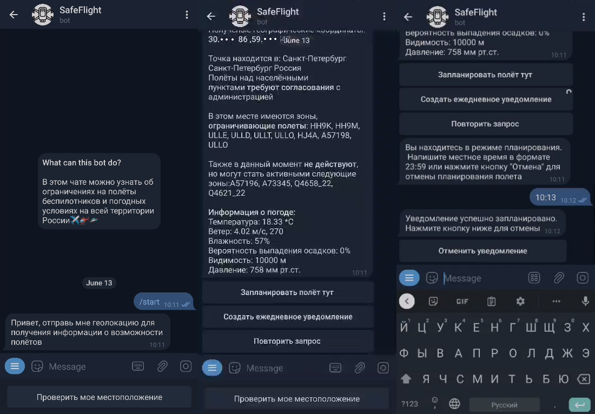

# safe-flight-bot
[Telegram бот](https://t.me/safe_flight_bot) для получения информации о зонах ограничения полетов на территории России на основе данных сервиса [map.avtm.center](https://map.avtm.center/).

## Реализованный функционал
* Проверка текущих ограничений полетов и метеоусловий в выбранном месте 
* Создание ежедневных уведомлений о состоянии зон ограничений полетов и метеоусловиях в выбранном месте
* Планирование полета с уведомлением об изменениях в структуре воздушного пространства и метеоусловиях в течение 3 дней до и 3 часов после начала полета.
## Пример работы

